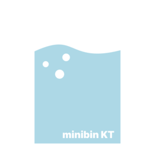

<p align="center">
  
  <h1 align="center">MiniBin v2</h1>
  <strong>Легковесная корзина в системном трее Windows 10 & 11 на Rust и Tauri v2.</strong><br/>
  <em>Lightweight system tray Recycle Bin companion for Windows 10 & 11 built with Rust & Tauri v2.</em>
</p>

<p align="center">
  <a href="https://github.com/kobaltgit/minibin/releases/latest"></a>
  <a href="https://kobaltgit.github.io/minibin/"></a>
  
  
  
  
  
  <a href="LICENSE"></a>
</p>

<p align="center">
  <a href="#-о-проекте">🇷🇺 Русский</a> • <a href="#-about-the-project">🇬🇧 English</a> • <a href="#-экосистема-kobalt-tools">🌐 Экосистема</a>
</p>

---

## 🇷🇺 О проекте

**MiniBin v2** — сверхлегковесная нативная утилита для Windows 10 & 11, входящая в экосистему системных инструментов **Kobalt Tools** ([StashIt](https://github.com/kobaltgit/StashIt), [Undoit](https://github.com/kobaltgit/undoit), [PolyShift](https://github.com/kobaltgit/polyshift), [PeekIt](https://github.com/kobaltgit/peekit)).

Приложение переносит управление Корзиной в область уведомлений (системный трей). Это позволяет полностью скрыть иконку корзины с рабочего стола, мгновенно просматривать удаленные файлы во всплывающем окне Flyout, точечно восстанавливать нужные объекты и очищать корзину в один клик.

Версия **v2.0** полностью переписана на **Rust 2021** и **Svelte 5** под движком **Tauri v2**, потребляет **всего 10–18 МБ RAM** (в 5 раз меньше Python-версии) и работает без прав администратора.

### ⚡ Сравнение с аналогами

| Показатель | MiniBin v2 (Rust + Tauri v2) | MiniBin v1 (Python / PyQt) | Стандартная Корзина Windows |
| :--- | :--- | :--- | :--- |
| **ОЗУ в фоне** | **10–18 МБ** | 60–90 МБ | Часть explorer.exe |
| **Интерфейс** | **Интерактивный Flyout (Fluent Acrylic)** | Контекстное меню | Отдельное тяжелое окно Проводника |
| **Управление файлами** | **Превью, поиск, точечное восстановление** | Очистка "вслепую" | Только открытие окна |
| **Темы значков** | **4 набора (Fluent, Win98 Retro, Minimal, Classic)** | 2 фиксированные | 1 статичный значок |
| **Автозапуск** | **Чистый HKCU (без UAC)** | ProgramData (требует Admin) | Системный |
| **Размер дистрибутива** | **~10 МБ** | ~60 МБ | Встроена в ОС |

### 🎯 Ключевые возможности

- 🪟 **Fluent Glassmorphism Flyout:** Красивое всплывающее окно у трея с акриловым размытием (`backdrop-filter`) и поддержкой светлой/тёмной темы.
- 📊 **Живой мониторинг объема:** Индикатор заполнения с предупреждающей подсветкой при превышении порога (5, 10, 20, 50 ГБ).
- 🔍 **Обозреватель удалённых объектов:** Список файлов в корзине с поиском по имени, размеру и исходному пути.
- ↩️ **Точечное восстановление:** Восстановление любого файла в исходную папку или безвозвратное удаление прямо из Flyout.
- 🖱️ **Настраиваемые действия мыши:** Назначение ЛКМ, СКМ и двойного клика на открытие Flyout, быструю очистку или открытие системной корзины.
- 🎨 **4 набора иконок трея:** Современный Fluent, ретро Windows 98, минималистичные контуры и классический стиль.
- 🚀 **Безопасная автозагрузка:** Запуск через ветку реестра `HKCU` без навязчивых запросов UAC.
- 🔊 **Звук и подтверждения:** Опциональный звук сминания бумаги и диалог защиты от случайного удаления.
- 🖥️ **Скрытие корзины с Рабочего стола:** Быстрый переход к апплету Windows для скрытия системного значка.

### 📥 Установка и загрузка

Скачайте актуальную версию со [страницы последнего релиза](https://github.com/kobaltgit/minibin/releases/latest):

- **Инсталлятор (`Setup.exe` или `.msi`):** Быстрая установка без прав администратора.
- **Portable версия (`.zip`):** Запуск в один клик без инсталляции.

---

## 🇬🇧 About the Project

**MiniBin v2** is an ultra-lightweight, native Windows 10 & 11 utility and part of the **Kobalt Tools** desktop ecosystem ([StashIt](https://github.com/kobaltgit/StashIt), [Undoit](https://github.com/kobaltgit/undoit), [PolyShift](https://github.com/kobaltgit/polyshift), [PeekIt](https://github.com/kobaltgit/peekit)).

It moves Recycle Bin management directly into the Windows system notification area (system tray). Clean up your desktop by hiding the default desktop trash icon, preview deleted files in an interactive acrylic flyout, restore individual items, and empty trash with a single click.

Version **v2.0** is completely overhauled in **Rust 2021** and **Svelte 5** under **Tauri v2**, consuming only **10–18 MB RAM** (5x less than Python) with zero administrator privileges required.

### ⚡ Key Benchmarks

| Metric | MiniBin v2 (Rust + Tauri v2) | MiniBin v1 (Python / PyQt) | Default Windows Recycle Bin |
| :--- | :--- | :--- | :--- |
| **Idle RAM** | **10–18 MB** | 60–90 MB | Part of explorer.exe |
| **UI Type** | **Interactive Flyout (Fluent Acrylic)** | Tray menu only | Bulky full Explorer window |
| **File Management** | **Preview, live search, selective restore** | Blind empty | Full window only |
| **Tray Themes** | **4 sets (Fluent, Win98 Retro, Minimal, Classic)** | 2 fixed icons | 1 static icon |
| **Autorun** | **Clean HKCU (zero UAC prompts)** | ProgramData (Admin needed) | System |
| **Installer Size** | **~10 MB** | ~60 MB | Built into Windows |

### 🎯 Core Features

- 🪟 **Fluent Glassmorphism Flyout:** Modern tray flyout window with backdrop acrylic blur adapting to Windows dark and light modes.
- 📊 **Real-time Capacity Dial:** Visual disk meter with warning glow when trash exceeds your limit (5, 10, 20, 50 GB).
- 🔍 **Deleted Items Explorer:** Interactive file list with instant search by filename, size, and original location.
- ↩️ **Selective Restore:** Restore any file back to its exact original directory or permanently shred it right from the flyout.
- 🖱️ **Customizable Mouse Actions:** Map Left Click, Middle Click, and Double Click to toggle flyout, instant clean, or Explorer.
- 🎨 **4 Icon Themes:** Fluent modern icons, nostalgic Windows 98 retro, sleek monochrome minimal, and classic.
- 🚀 **Clean User-Mode Startup:** Registry-based autorun in `HKCU` without intrusive UAC popups.
- 🔊 **Sound & Safety Confirmations:** Optional paper crumple sound effect and accidental clean prevention dialog.

### 📥 Installation & Download

Download the latest version from [GitHub Releases](https://github.com/kobaltgit/minibin/releases/latest):

- **Installer (`Setup.exe` / `.msi`):** User-mode installer with start menu shortcuts.
- **Portable (`.zip`):** Ready-to-use archive, no installation needed.

---

## 🛠️ Сборка и разработка / Development

```bash
# 1. Установка зависимостей фронтенда
npm install

# 2. Запуск в режиме разработки (Hot Reload)
npm run tauri dev

# 3. Сборка релизного установщика
npm run tauri build
```

---

## 🌐 Экосистема Kobalt Tools

| Проект | Описание | Стек | Ссылки |
| :--- | :--- | :--- | :--- |
| 📥 **StashIt** | Плавающий карман Drag-and-Drop (Dropover / Yoink для Windows) | Rust + Tauri v2 + Svelte 5 | [Repo](https://github.com/kobaltgit/StashIt) • [Web](https://kobaltgit.github.io/StashIt/) |
| 🗑️ **MiniBin** | Умная корзина в системном трее с Flyout-интерфейсом | Rust + Tauri v2 + Svelte 5 | [Repo](https://github.com/kobaltgit/minibin) • [Web](https://kobaltgit.github.io/minibin/) |
| ⏱️ **Undoit** | Локальная машина времени и версионирование файлов (Ctrl+Z) | Rust + Tauri v2 + Svelte 5 | [Repo](https://github.com/kobaltgit/undoit) • [Web](https://kobaltgit.github.io/Undoit/) |
| 🌐 **PolyShift** | HUD-помощник и контекстный перевод у курсора с Gemini AI | Rust + Tauri v2 + Svelte 5 | [Repo](https://github.com/kobaltgit/polyshift) • [Web](https://kobaltgit.github.io/polyshift/) |
| 👁️ **PeekIt** | Мгновенный предпросмотр файлов по клавише Space | Rust + Tauri v2 + Svelte 5 | [Repo](https://github.com/kobaltgit/peekit) • [Web](https://kobaltgit.github.io/PeekIt/) |
| 🧩 **PeekIt Plugins** | Официальный реестр и SDK веб-плагинов для PeekIt | TypeScript + Web SDK | [Repo](https://github.com/kobaltgit/peekit-plugins) • [Web](https://kobaltgit.github.io/peekit-plugins/) |
| 🎨 **kobalt_ui** | Общая библиотека UI компонентов (шапка, футер, релизы) | Flutter Web (Dart) | [Repo](https://github.com/kobaltgit/kobalt_ui) |

---

## 📄 Лицензия / License

Распространяется под лицензией **MIT**. Подробнее в файле [LICENSE](LICENSE).